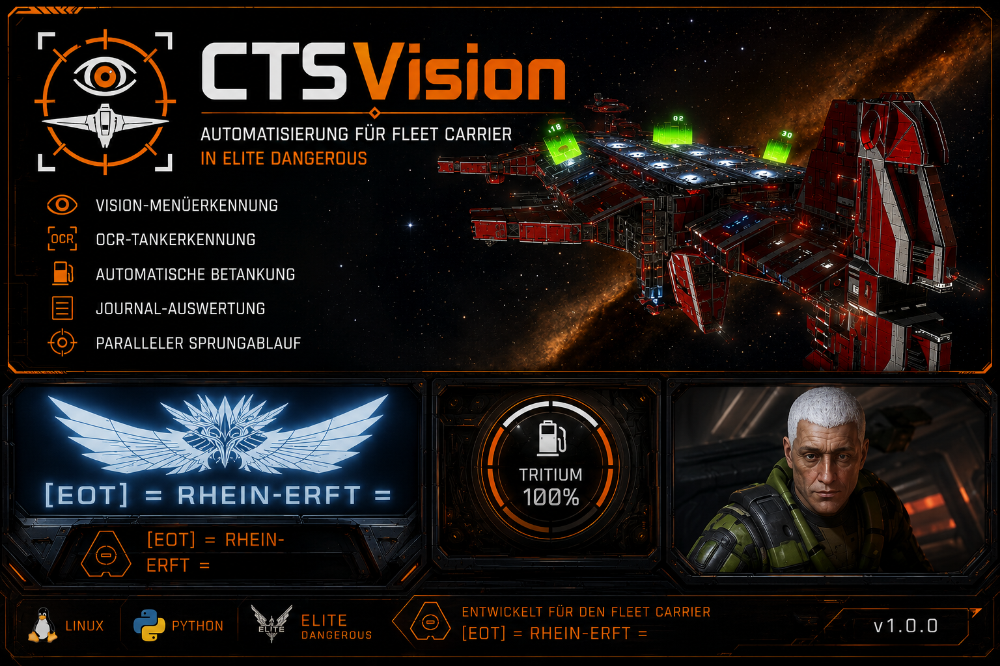
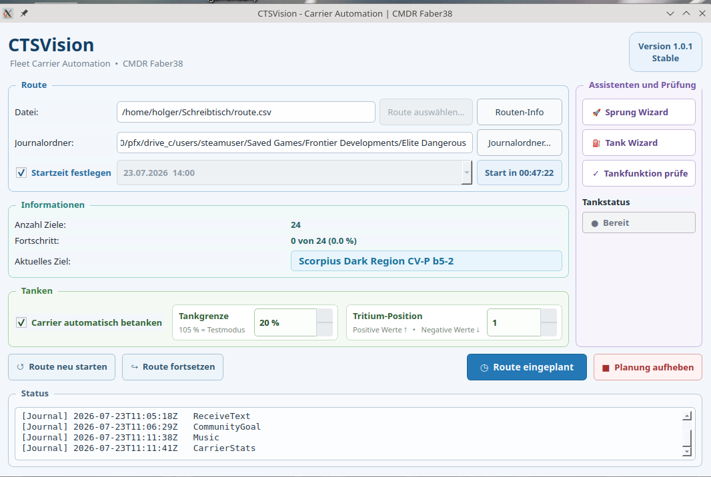

# 🚀 CTSVision

<p align="center">
  
</p>

<p align="center">


</p>

**Computer Vision für Fleet Carrier in Elite Dangerous**

CTSVision automatisiert Fleet-Carrier-Abläufe unter Linux. Statt mit festen Zeitabläufen zu arbeiten, erkennt das Programm den tatsächlichen Spielzustand über **Computer Vision**, **OCR** und das **Elite-Journal** und trifft seine Entscheidungen dynamisch.

---

# ✨ Highlights

- 🚀 Automatische Fleet-Carrier-Sprünge
- ⛽ Automatisches Betanken des Fleet Carriers
- 👁️ Vision-basierte Menünavigation
- 🔍 OCR-Auswertung des Tritium-Tankfüllstands
- 📖 Elite-Journal-Auswertung
- 🧪 Vision Wizard zum Erstellen von Referenzbildern
- ⛽ Tank Wizard zum Testen der Tankfunktion
- 💾 Fortsetzen gespeicherter Routen
- 🐧 Entwickelt für Linux (Pop!_OS)

---

# 📸 Oberfläche

> Füge hier einen Screenshot des Hauptfensters ein.

<p align="center">
  
</p>

---

# 🛠️ Installation

```bash
git clone https://github.com/Faber38/CTSVision.git
cd CTSVision
./install.sh
./start.sh
```

---

# 🖼️ Ersteinrichtung

Beim ersten Start werden mit dem **Vision Wizard** die Referenzbilder erstellt. Dieser Schritt ist pro Rechner nur einmal notwendig.

## Vision Wizard

- Erstellt Referenzbilder passend zu deiner Auflösung.
- Kalibriert die Bilderkennung.
- Referenzbilder immer so klein wie möglich und nur so groß wie nötig erstellen.
- Nur unveränderliche Elemente (z. B. Menüs, Symbole oder Schaltflächen) erfassen. Dynamische Hintergründe wie Sterne, Nebel oder Planeten möglichst vermeiden.

## Tank Wizard

- Prüft die komplette Tankfunktion.
- Testet die Tritium-Erkennung ohne einen echten Tankvorgang.

---

# ⛽ Tritium-Position

Mit der Einstellung **Tritium-Position** wird festgelegt, an welcher Position CTSVision die Suche nach **TRITIUM** beginnt.

| Wert | Bedeutung |
|------:|-----------|
| 0 | Erste Listenzeile |
| -5 | 5 Zeilen nach unten |
| -20 | 20 Zeilen nach unten |
| -44 | 44 Zeilen nach unten |
| 3 | 3 Zeilen nach oben |

Anschließend wird automatisch ein kleiner Bereich um diese Position durchsucht.

---

# 🖥️ Voraussetzungen

- Linux
- Python 3.11+
- X11
- Elite Dangerous: Odyssey

---

# 🛣️ Roadmap

## Version 1.0.x

- ✅ Vision-System
- ✅ OCR
- ✅ Carrier-Sprünge
- ✅ Automatische Tankfunktion
- ✅ Routenfortsetzung

## Geplant

- Mehrere Schiffprofile
- Erweiterte Vision-Profile
- Weitere Komfortfunktionen

---

# 🤝 Feedback

Fehlermeldungen, Screenshots und Logdateien helfen dabei, CTSVision weiter zu verbessern.

---

# ❤️ Danke

Vielen Dank an alle Tester und Commander, die CTSVision ausprobieren und mit ihrem Feedback verbessern.

**Fly safe, Commander! o7**

**CMDR Faber38**

---

**Version:** 1.0.1  
**Status:** Stable
