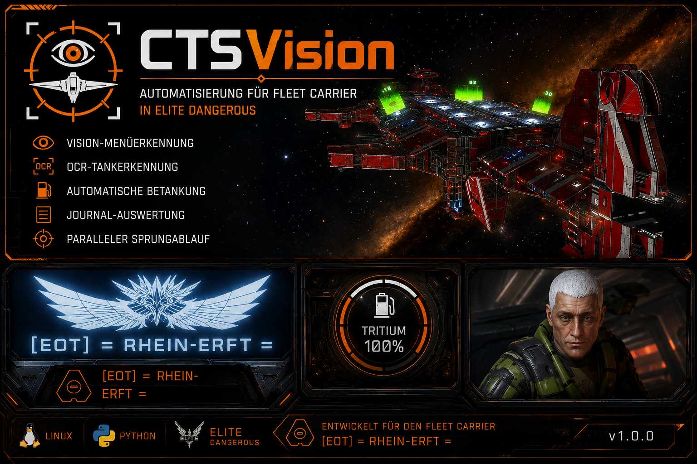
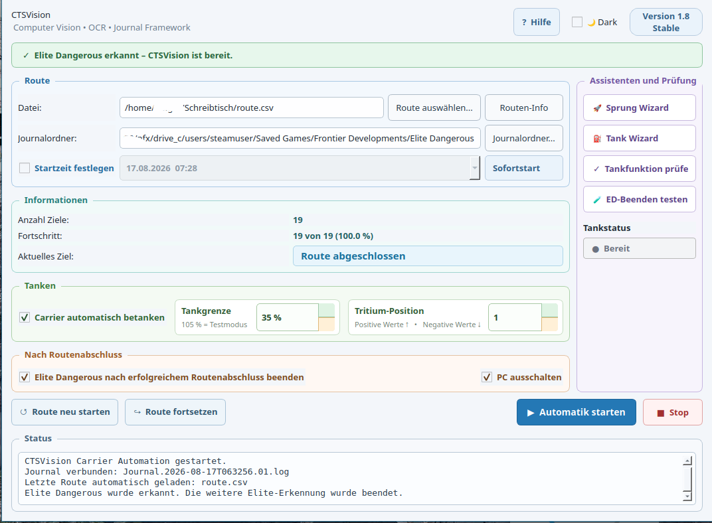

# CTSVision

> **Computer-Vision-, OCR- und Journal-Framework für Elite Dangerous**

[🇩🇪 Deutsch](README_DE.md) | [🇬🇧 English](README.md)

## ⚠️ Wichtiger Hinweis – Frontier Developments / Elite Dangerous

CTSVision automatisiert bestimmte Abläufe bei der Nutzung eines Fleet Carriers in **Elite Dangerous**. Die Richtlinien von Frontier Developments untersagen bestimmte Formen der Spielautomatisierung. Fleet-Carrier-Automatisierung kann als Verstoß gegen diese Richtlinien gewertet werden.

**Die Verwendung von CTSVision kann daher zu Verwarnungen, Einschränkungen, einer vorübergehenden Sperre oder anderen Maßnahmen gegen deinen Elite-Dangerous-Account führen.**

CTSVision ist ein unabhängiges Community-Projekt und steht **in keiner Verbindung zu Frontier Developments, wird nicht von Frontier Developments unterstützt und ist nicht von Frontier Developments genehmigt**.

**Die Verwendung dieser Software erfolgt vollständig auf eigenes Risiko.**

Bitte informiere dich vor der Verwendung von CTSVision über die aktuellen **Elite Dangerous Terms of Use, die EULA und den Frontier Code of Conduct**.

## Was ist CTSVision?

CTSVision ist ein Open-Source-Projekt zur Analyse der Benutzeroberfläche von **Elite Dangerous**.



Das Framework kombiniert **Computer Vision**, **OCR (PaddleOCR)** und **Journal-Auswertung**, um Spielzustände zuverlässig zu erkennen.

### Funktionen
- Vision-basierte Menüerkennung
- OCR (PaddleOCR)
- Journal-Monitor
- Vision Wizard
- Referenzbildverwaltung
- Debug-Werkzeuge
- Native Linux-Unterstützung
- Modulare Architektur

# 🚀 Quick Start

## 1. Repository herunterladen

```bash
git clone https://github.com/Faber38/CTSVision.git
cd CTSVision
```

## 2. Installation

Führe das Installationsskript aus:

```bash
chmod +x install.sh start.sh
./install.sh
```

Das Skript erstellt automatisch:

- die Python Virtual Environment
- installiert alle benötigten Python-Pakete
- richtet CTSVision für den ersten Start ein

## 3. CTSVision starten

Nach erfolgreicher Installation genügt zukünftig:

```bash
./start.sh
```

Das Startskript

- aktiviert automatisch die Python-Umgebung,
- prüft, ob **Elite Dangerous** bereits läuft,
- und startet anschließend CTSVision.

---

# 👁 Erster Start

Vor der ersten Verwendung sollten mit dem **Vision Wizard** Referenzbilder für die eigene Bildschirmauflösung erstellt werden.

Eine gute Qualität der Referenzbilder ist entscheidend für eine zuverlässige Bilderkennung.

## Empfehlungen

- Referenzbilder immer **so klein wie möglich und nur so groß wie nötig** erstellen.
- Nur statische Elemente wie Menüs, Symbole oder Schaltflächen aufnehmen.
- Sterne, Nebel, Planeten oder andere dynamische Hintergründe vermeiden.
- Nach Änderungen der Bildschirmauflösung oder UI-Skalierung neue Referenzbilder erstellen.
- Die erzeugten Referenzbilder anschließend mit dem Vision Wizard testen.

## Projektphilosophie

CTSVision trifft keine unsicheren Entscheidungen.

**Robustheit vor Geschwindigkeit.**

### Version 1.7
✨ Neu
 - ED nach erfolgreichem Beenden der Sprungroute ausschalten.
   Ausdrücklich nur wenn die Automation erfolgreich beendet wurde.
 - Wenn gewünscht kann danach der PC aus geschaltet werden.
   Dieser schaltet sich nur aus wenn das beenden von ED erfolgreich war.


### Version 1.6
 - Route wird direkt nach dem CarrierJump aktualisiert.
 - Das aktuelle Ziel wird unmittelbar als erledigt markiert.
 - Das nächste Sprungziel wird sofort in der GUI angezeigt.
 - Die Routenanzeige ist dadurch während der gesamten Abkühlzeit aktuell.
 - Tankprüfung vor dem ersten Sprung.
 - Vor dem ersten Sprung wird jetzt geprüft, ob genügend Tritium im Carrier vorhanden ist.
 - Falls erforderlich, wird automatisch nachgetankt.
 - Der erste Sprung startet erst nach erfolgreicher Tankprüfung.

Verbesserungen
Konsistenter Ablauf zwischen erstem und allen folgenden Sprüngen.
Immer aktueller Routenstatus während der Abkühlphase.
Höhere Sicherheit vor dem Start einer langen Carrier-Route.

### Version 1.5
- Vision Wizard
- OCR
- Journal Monitor
- Tank Wizard
- Workspace-Schutz



## Roadmap

### Version 2.0
- Mehrsprachigkeit
- Windows-Unterstützung
- Plugin-System

GNU GPL v3.0

Entwickelt von **Faber38**
